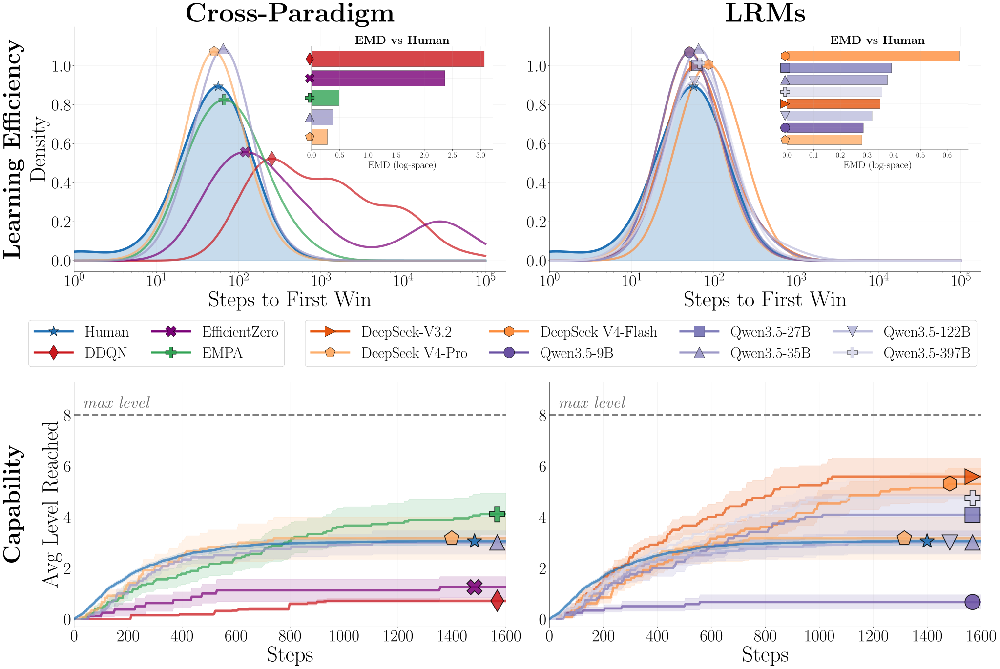
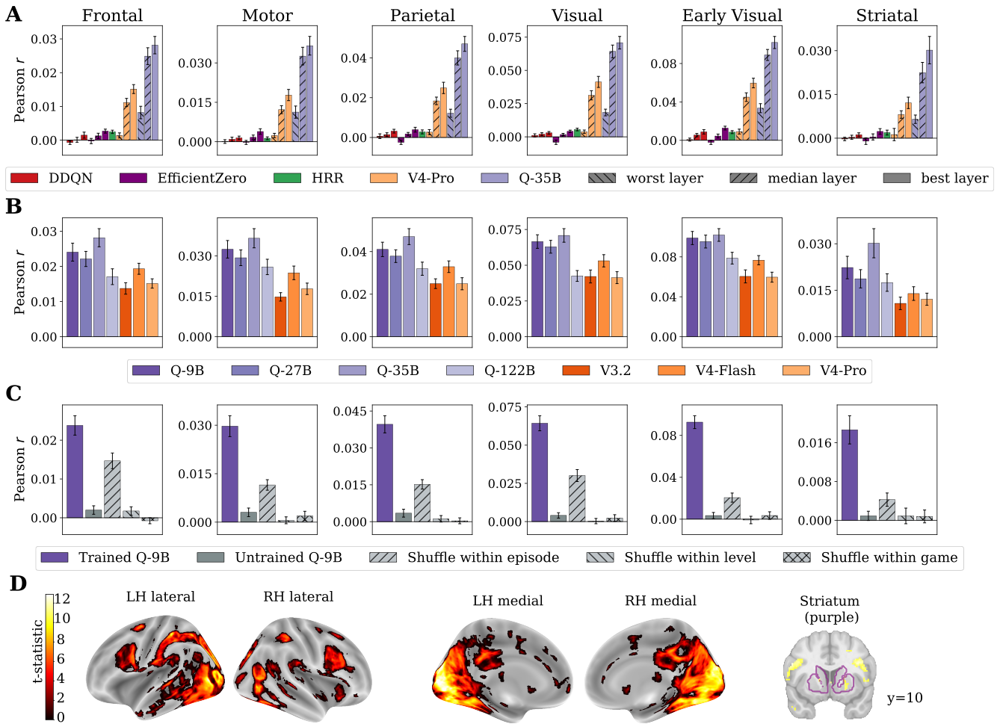

# Reason to Play

Source code for **Reason to Play: Behavioral and Brain Alignment Between Frontier LRMs and Human Game Learners.**

Live site, interactive replay catalogue, representation viewer, and paper:
**[botcs.github.io/reason-to-play](https://botcs.github.io/reason-to-play/)**

We drop human participants (32, scanned with fMRI) and a suite of frontier Large Reasoning Models into a set of simple grid-world video games written in a compact language called VGDL, with no rules provided, and ask whether the models learn the way humans do, and whether they build similar internal representations.

## Headline results

### Do LRMs learn the way humans do?

We compare how quickly each agent discovers the rules of a game, and how far through a curriculum of nine difficulty levels it can progress. Human participants, deep-RL baselines (DDQN, EfficientZero, EMPA), and eight frontier LRMs all play the same games under the same conditions.

The best LRMs cluster tightly around the human learning distribution. On the discovery metric, the top LRM is nearly indistinguishable from the human median; on the curriculum metric, it tracks human-level progression through all nine difficulty levels. The deep-RL baselines, by contrast, are far slower and plateau much earlier.



> **Learning efficiency and capability.** Top: discovery-time distributions (KDE); LRMs overlap with humans while deep-RL baselines are shifted far right. Bottom: curriculum progression under blocked advancement (two consecutive wins required to advance); the best LRMs track the human staircase closely.

### Do they build similar brain representations?

We extract hidden-state activations from each LRM during gameplay and use them as regressors in a voxelwise encoding model that predicts the human fMRI BOLD signal, with separate regularisation for the model features and the nuisance regressors (game / level identity, button presses, time). Best-layer Pearson correlations are then averaged within functional region groups.

LRM representations predict brain activity significantly above chance across visual, frontoparietal and default-mode regions, and outperform DDQN and EfficientZero baselines by a wide margin across every cortical region group. Targeted ablations (prompt-only, shuffled-features, random-init controls) confirm that the signal comes from the model's in-context representation of the game state, not from surface-level prompt statistics or chance correlations.



> **Brain encoding accuracy by region group.** Best-layer Pearson correlation averaged across voxels within each functional group. LRM features (right) consistently outperform deep-RL baselines (left) across cortical regions.

## What's in this repository

```
src/
  llm_eval/                  LLM evaluation pipeline
    shared/                  config, harness, prompt loading, event logging,
                             observation formatting, response parsing,
                             LLM wrappers (OpenRouter, Transformers, DeepSpeed)
    generative_gameplay/     LLM plays games (agent loop, Hydra entry point)
    human_replay/            replay pipeline (imputation + feature extraction)
  vgdl/                      VGDL game engine (interpreter, sprites, renderer)
prompts/
  gameplay/                  system prompts by rationale_mode x suggestion_level
  replay/                    imputation prompts for human replay pipeline
  game_rules/                per-game oracle rule descriptions
games/                       VGDL game description + level layout files
sweeps/                      W&B sweep configs for the experiment grid
conf/
  config.yaml                Hydra default configuration
figures/                     headline behavioural + neural figures
```

## Quickstart

Generative gameplay (LRM plays a game from scratch, no rules):

```bash
python -m src.llm_eval.generative_gameplay.run \
    game.game=bait_vgfmri4 \
    llm.backend=openrouter llm.model=<MODEL> \
    harness.rationale_mode=copied-reasoning
```

Human replay imputation (run an LRM through a participant's recorded
keypresses to reconstruct the per-step "think aloud"):

```bash
python -m src.llm_eval.human_replay.run_replay \
    replay.subject=sub-01 \
    harness.rationale_mode=action-only
```

## Cite

```bibtex
@article{botos2026reason,
  title   = {Reason to Play: Behavioral and Brain Alignment
             Between Frontier LRMs and Human Game Learners},
  author  = {Botos, Csaba and Kumar, Sreejan and
             Andrews, Austin Tudor David and Hunt, Laurence and
             Summerfield, Chris and Tenenbaum, Joshua B. and
             Costa, Rui Ponte and Mattar, Marcelo G. and
             Tomov, Momchil},
  year    = {2026}
}
```

## License

MIT. See `LICENSE`.
