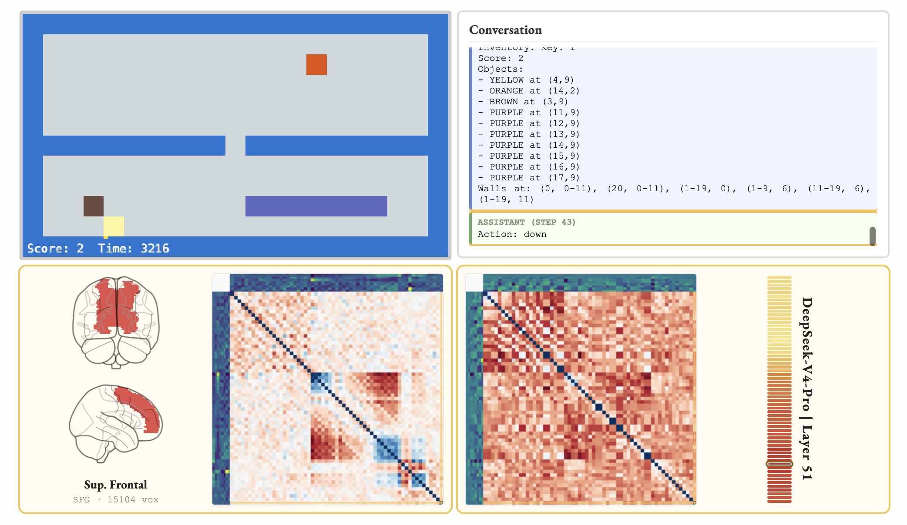

# Reason to Play

[](https://botcs.github.io/reason-to-play/)

Source code for **Reason to Play: Behavioral and Brain Alignment Between Frontier LRMs and Human Game Learners.**

_Botos Csaba, Sreejan Kumar, Austin Tudor David Andrews, Laurence Hunt, Chris Summerfield, Joshua B. Tenenbaum, Rui Ponte Costa, Marcelo G. Mattar, Momchil Tomov_

**[Landing Page](https://botcs.github.io/reason-to-play/)** ·
**[NeurIPS 2026 OpenReview](https://openreview.net/forum?id=Y1oX1yuaWM)** ·
**[Behavioral & Representational Dataset](https://huggingface.co/datasets/csbotos/reason-to-play)**

The study compares 32 human participants, scanned with fMRI, with models learning
grid-world games written in [VGDL](https://github.com/schaul/py-vgdl). 
Participants and models infer the game rules through play. 
The analyses compare their behavior and internal representations.

## TL;DR

- **Analyze the data:** compare human and agent behavior or fit neural encoding
  models using the [released dataset](docs/guides/dataset-analysis.md).
  Raw OpenNeuro downloads are not needed for these analyses.
- **Run new experiments:** start with [Setup](#setup) and
  [Quickstart](#quickstart) for model gameplay and human replay. The
  [workflow guides](#workflows) cover activation extraction and analysis.

For agent-assisted contributions, start with [AGENTS.md](AGENTS.md).

**Acknowledgement:** This project would not have been possible without the invaluable contributions of the community.
For projects that we heavily relied on are listed in [THIRD_PARTY.md](THIRD_PARTY.md).


## Setup

For behavioral and neural analysis from the derivative dataset:

```bash
python -m pip install -e '.[analysis]'
```

Minimal install (OpenRouter-backed gameplay and action-only human replay; no local GPU inference):

```bash
python -m pip install -e '.[lrm]'
```

For local model inference and activation extraction, follow the
[installation guide](docs/reproducibility.md#installation), including the
GPU/runtime requirements for the selected model.

## Quickstart

After installation, call the Python modules directly. Configuration overrides
select the model, game, inputs and outputs. The
[workflow guide](docs/reproducibility.md#replay-and-model-gameplay) has the full
examples and configuration details.

Generative gameplay uses an OpenRouter model and requires `OPENROUTER_API_KEY`:

```bash
python -m agents.lrm.play \
    game.game=bait_vgfmri4 \
    llm.backend=openrouter llm.model=<MODEL> \
    harness.rationale_mode=copied-reasoning
```

Human action-only replay (recorded keypresses, no model API call):

```bash
python -m agents.lrm.prepare_prompts \
    replay.subject=sub-01 \
    replay.data_dir=/absolute/path/to/behavior/human \
    harness.rationale_mode=action-only
```

## Workflows

| Task | Guide |
| --- | --- |
| Run model gameplay or replay human actions | [Gameplay and replay](docs/reproducibility.md#replay-and-model-gameplay) |
| Extract model activations from replay traces | [Latent activation extraction](docs/reproducibility.md#latent-activation-extraction) |
| Preprocess fMRI and align behavior and features to scanner time | [Raw reconstruction](docs/guides/fmri-preprocessing.md) and [dataset analysis](docs/guides/dataset-analysis.md) |
| Compare behavioral performance | [Behavioral analysis](docs/reproducibility.md#behavioural-analysis-without-cloud-credentials) |
| Fit neural encoding models and aggregate their results | [Neural analysis](docs/guides/dataset-analysis.md#neural-encoding-from-processed-inputs) |
| Run DDQN, EfficientZero and EMPA integrations | [Baselines](docs/guides/baselines.md) |
| Align EfficientZero traces to processed BOLD samples | [EfficientZero features](docs/guides/baselines.md#efficientzero-hidden-features) |
| Train EfficientZero with the optional pinned upstream submodule | [EfficientZero training](docs/guides/baselines.md#efficientzero-training) |

Use the documented Python modules and scripts directly. Workflow details live
in these guides; [AGENTS.md](AGENTS.md) maps tasks to their implementations and
tests. Keep the paper's study settings explicit when adapting an experiment.
EfficientZero analysis and feature extraction use included code; only training
requires initializing `agents/efficientzero/training/`.

## Code layout

```text
agents/              lrm/, ddqn/, efficientzero/, empa/
human/               Participant/game recordings and BOLD processing
analysis/            behavioral/ and neural/ comparisons
data/                Replay encoding, identifiers and value formats
environments/        VGDL interpreter and translated game definitions
experiments/         NeurIPS 2026 configurations by agent and analysis
reconstruction/      Optional processing from raw OpenNeuro data
docs/                Workflow guides, formats and preceding sources
tests/               Input, model and analysis checks
scripts/release/     Dataset inventory and catalogue preparation
```

Downloaded datasets live outside these source directories. Each agent's gameplay,
training or feature extraction code lives with that agent; comparisons between
humans and agents live in `analysis/`.

## Data

The accompanying [Hugging Face dataset](https://huggingface.co/datasets/csbotos/reason-to-play)
contains human gameplay, model prompts and activations, processed fMRI, and
analysis results. Use the
[verified snapshot](https://huggingface.co/datasets/csbotos/reason-to-play/tree/0c674c3ff19b64a55f3fba6d862f5fb828292b74)
for reproducible downloads. The [dataset card](docs/release/huggingface-dataset-card.md)
describes the files and download examples.

The original raw human data are available in
[OpenNeuro ds004323 v1.0.0](https://openneuro.org/datasets/ds004323/versions/1.0.0).
Those datasets and LRM model weights are separate from this code checkout.

## License

Original project code and newly created research artifacts are released jointly
under [MIT](LICENSE). Upstream material retains its existing terms:
[THIRD_PARTY.md](THIRD_PARTY.md) records component licenses and attribution,
including CC0 for the original OpenNeuro data and separate model-weight terms.
