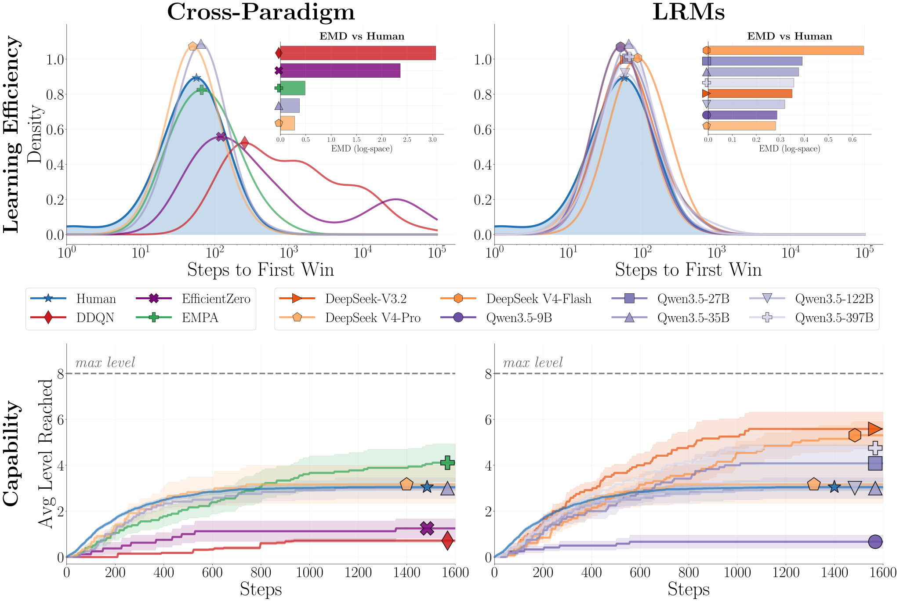
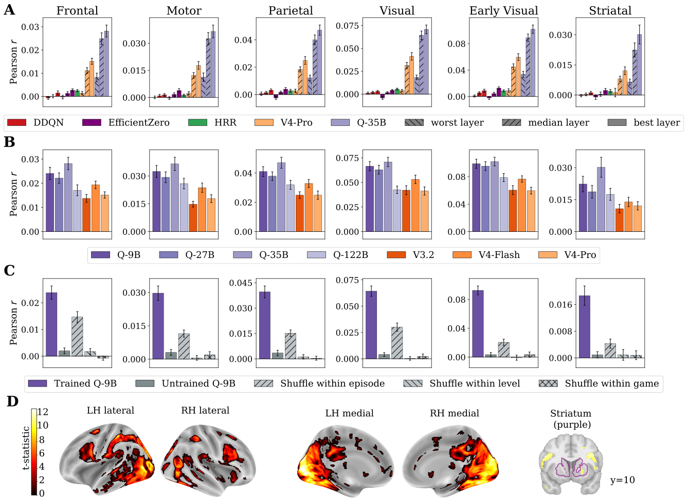

# Reason to Play

Source code for **Reason to Play: Behavioral and Brain Alignment Between Frontier LRMs and Human Game Learners.**

_Botos Csaba, Sreejan Kumar, Austin Tudor David Andrews, Laurence Hunt, Chris Summerfield, Joshua B. Tenenbaum, Rui Ponte Costa, Marcelo G. Mattar, Momchil Tomov_

**[NeurIPS 2026 paper](https://openreview.net/forum?id=Y1oX1yuaWM)** ·
**[Preprint](https://arxiv.org/abs/2605.08019)** ·
**[Interactive results](https://botcs.github.io/reason-to-play/)** ·
**[Reproduction guide](docs/reproducibility.md)** ·
**[Citation](CITATION.cff)**

For agent-assisted contributions, start with [AGENTS.md](AGENTS.md).

Use the webapp to [inspect replay files](https://botcs.github.io/reason-to-play/replay.html),
[browse the replay catalogue](https://botcs.github.io/reason-to-play/catalogue.html),
or [play the games](https://botcs.github.io/reason-to-play/interactive-gameplay.html).
Python runs the experiments and produces data; the webapp provides the viewer.

Accepted at **NeurIPS 2026**. This repository contains Python code for model
gameplay, human replay, activation extraction, fMRI processing, and behavioral
and neural analysis. Use these workflows to study new models and experimental
conditions as well as the paper's experiments. The
[reproduction guide](docs/reproducibility.md) documents inputs, configurations,
outputs and the checks performed so far.

> **Acknowledgement:** Development began on 11 January 2026 from an early,
> private version of Cedric Colas's `infer-vgdl` code. The related source was
> subsequently published as
> [Language and Experience: A Computational Model of Social Learning in
> Complex Tasks](https://github.com/ccolas/language_and_experience).
> The VGDL harness, game suite, and some LLM scaffolding originate there.
> We thank Cedric and collaborators for granting early access. Further source
> history and attribution are in [Sources](docs/sources/README.md) and
> [THIRD_PARTY.md](THIRD_PARTY.md).

The study compares 32 human participants, scanned with fMRI, with models learning
grid-world games written in VGDL. Participants and models infer the game rules
through play. The analyses compare their behavior and internal representations.

## Setup

For behavioral and neural analysis from the derivative dataset:

```bash
python -m pip install -e '.[analysis]'
```

The [dataset analysis guide](docs/guides/dataset-analysis.md) starts from canonical
human recordings and processed neural inputs, without OpenNeuro BSON or raw MRI.
The [data format guide](docs/data-format.md) explains self-contained per-game
human files, conversations, frames, actions and measurement identities.
The dataset groups gameplay under `behavior/`, frame and prompt activations
under `features/`, participant BOLD and scanner-sampled model inputs under
`neural/sub-XX/`, and analysis outputs under `results/`.
Agent families use the same names in each group. The
[dataset card](docs/release/huggingface-dataset-card.md) describes the layout and
download catalogues. Preprocessing outputs for reconstruction are optional.

Minimal install (OpenRouter-backed gameplay and action-only human replay; no local GPU inference):

```bash
python -m pip install -e '.[lrm]'
```

For local model inference and activation extraction, follow the
[installation guide](docs/reproducibility.md#installation), including the
GPU/runtime requirements for the selected model.

## Quickstart

After installation, call the Python modules directly. Configuration overrides
select the model, game, inputs and outputs. The
[workflow guide](docs/reproducibility.md#replay-and-model-gameplay) has the full
examples and configuration details.

Generative gameplay uses an OpenRouter model and requires `OPENROUTER_API_KEY`:

```bash
python -m agents.lrm.play \
    game.game=bait_vgfmri4 \
    llm.backend=openrouter llm.model=<MODEL> \
    harness.rationale_mode=copied-reasoning
```

Human action-only replay (recorded keypresses, no model API call):

```bash
python -m agents.lrm.prepare_prompts \
    replay.subject=sub-01 \
    replay.data_dir=/absolute/path/to/behavior/human \
    harness.rationale_mode=action-only
```

## Workflows

| Task | Guide |
| --- | --- |
| Run model gameplay or replay human actions | [Gameplay and replay](docs/reproducibility.md#replay-and-model-gameplay) |
| Extract model activations from replay traces | [Latent activation extraction](docs/reproducibility.md#latent-activation-extraction) |
| Preprocess fMRI and align behavior and features to scanner time | [Raw reconstruction](docs/guides/fmri-preprocessing.md) and [dataset analysis](docs/guides/dataset-analysis.md) |
| Compare behavioral performance | [Behavioral analysis](docs/reproducibility.md#behavioural-analysis-without-cloud-credentials) |
| Fit neural encoding models and aggregate their results | [Neural analysis](docs/guides/dataset-analysis.md#neural-encoding-from-processed-inputs) |
| Run DDQN, EfficientZero and EMPA integrations | [Baselines](docs/guides/baselines.md) |
| Align EfficientZero traces to processed BOLD samples | [EfficientZero features](docs/guides/baselines.md#efficientzero-hidden-features) |
| Train EfficientZero with the optional pinned upstream submodule | [EfficientZero training](docs/guides/baselines.md#efficientzero-training) |

Use the documented Python modules and scripts directly. Workflow details live
in these guides; [AGENTS.md](AGENTS.md) maps tasks to their implementations and
tests. Keep the paper's study settings explicit when adapting an experiment.
EfficientZero analysis and feature extraction use included code; only training
requires initializing `agents/efficientzero/training/`.

## Code layout

```text
agents/              lrm/, ddqn/, efficientzero/, empa/
human/               Participant/game recordings and BOLD processing
analysis/            behavioral/ and neural/ comparisons
data/                Replay encoding, identifiers and value formats
environments/        VGDL interpreter and translated game definitions
experiments/         NeurIPS 2026 configurations by agent and analysis
reconstruction/      Optional processing from raw OpenNeuro data
docs/                Workflow guides, formats and preceding sources
tests/               Input, model and analysis checks
scripts/release/     Dataset inventory and catalogue preparation
```

Downloaded datasets live outside these source directories. Each agent's gameplay,
training or feature extraction code lives with that agent; comparisons between
humans and agents live in `analysis/`.

## Data

The original human data are available in
[OpenNeuro ds004323 v1.0.0](https://openneuro.org/datasets/ds004323/versions/1.0.0).
Datasets and model weights are separate from this code checkout.

The Hugging Face release is being prepared for `csbotos/reason-to-play`:
canonical human recordings, model prompts and gameplay, activations, processed
fMRI inputs, ROI resources and analysis outputs. It has not been uploaded. The
manifest records each file’s identity, contents and checksum when byte-verified. The [dataset card draft](docs/release/huggingface-dataset-card.md)
describes the selection, omissions and catalogue loading interface.

Dataset paths are recorded in the release manifest. They do not depend on where
the Python implementation lives. The [release guide](docs/release/manifest-guide.md)
documents the manifest and verification process.

## Headline results

### Do LRMs learn the way humans do?

We compare how quickly each agent discovers the rules of a game, and how far through a curriculum of nine difficulty levels it can progress. Human participants, deep-RL baselines (DDQN, EfficientZero, EMPA), and eight frontier LRMs play related VGDL game variants. Humans advanced on a fixed scanner schedule, while LRMs used blocked advancement; the analysis applies an explicit comparison rule. Some converted game variants also differ in their timeout rules. See the reproduction guide before comparing raw level counts or elapsed time.

The best LRMs cluster tightly around the human learning distribution. On the discovery metric, the top LRM is nearly indistinguishable from the human median; on the curriculum metric, it tracks human-level progression through all nine difficulty levels. The deep-RL baselines, by contrast, are far slower and plateau much earlier.



> **Learning efficiency and capability.** Top: discovery-time distributions (KDE); LRMs overlap with humans while deep-RL baselines are shifted far right. Bottom: curriculum progression under blocked advancement (two consecutive wins required to advance); the best LRMs track the human staircase closely.

### Do they build similar brain representations?

We extract hidden-state activations from models encoding human gameplay traces and use them to predict the human fMRI BOLD signal. The encoding code supports separate regularisation for model features and optional nuisance bands; the selected condition determines which bands are fitted. Best-layer Pearson correlations are then averaged within functional region groups. See the [neural workflow](docs/reproducibility.md#fmri-reconstruction-and-shared-data-paths) and [reproduction limits](docs/reproduction-limits.md) for the retained analysis settings and known artifact gaps.

LRM representations predict brain activity significantly above chance across visual, frontoparietal and default-mode regions, and outperform DDQN and EfficientZero baselines by a wide margin across every cortical region group. Targeted ablations (prompt-only, shuffled-features, random-init controls) confirm that the signal comes from the model's in-context representation of the game state, not from surface-level prompt statistics or chance correlations.



> **Brain encoding accuracy by region group.** Best-layer Pearson correlation averaged across voxels within each functional group. LRM features (right) consistently outperform deep-RL baselines (left) across cortical regions.

## Cite

Please cite the **NeurIPS 2026** paper. [CITATION.cff](CITATION.cff) is the
canonical citation record; GitHub's **Cite this repository** menu provides
BibTeX and APA exports from its preferred paper citation. Proceedings details
will be added there when available.

## License

Original project code and newly created research artifacts are released jointly
under [MIT](LICENSE). Upstream material retains its existing terms:
[THIRD_PARTY.md](THIRD_PARTY.md) records component licenses and attribution,
including CC0 for the original OpenNeuro data and separate model-weight terms.
