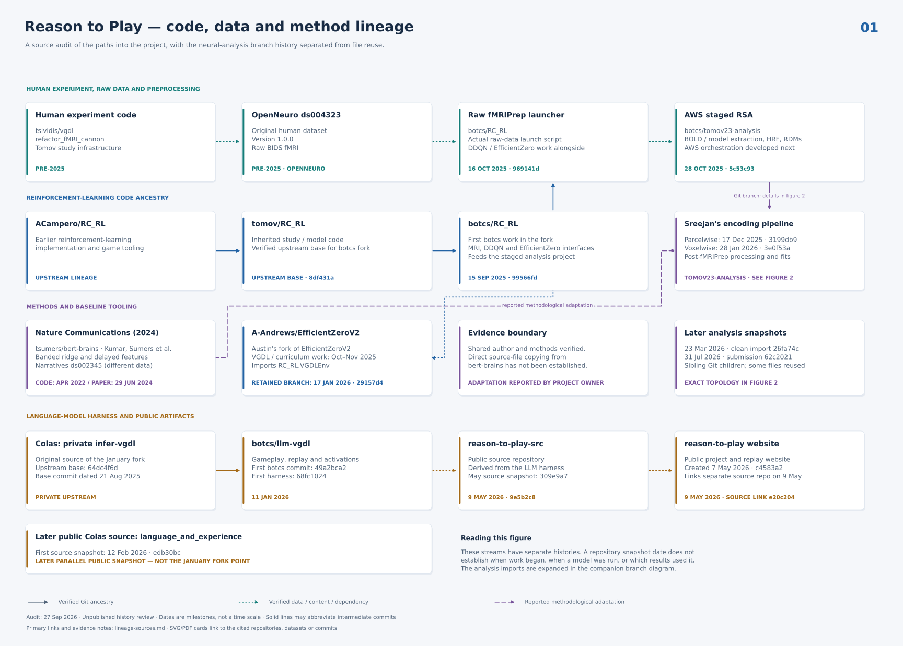
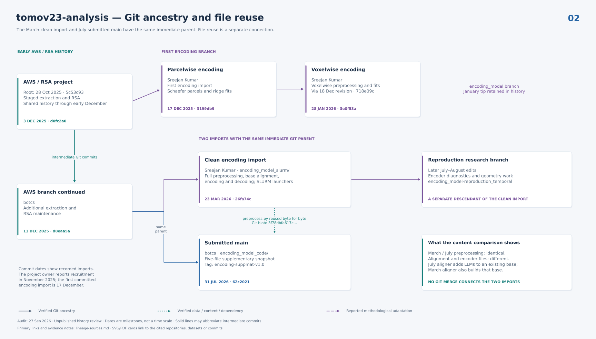

# Research-code lineage

Reconstructed from Git history, retained fMRIPrep configurations, S3 source
backups, and the author's account on 27 September 2026.

[Download the two-page PDF](lineage-all.pdf) · [Evidence ledger](lineage-sources.md)

The project began in September 2025 with DDQN/environment work derived from
`tomov/RC_RL`. Original experimental code lives in the separate
`tsividis/vgdl` fMRI reference. The actual fMRIPrep launcher was committed in
RC_RL in October. `tomov23-analysis` began later that month as a staged AWS/RSA
pipeline; parcel and voxel encoding imports followed in December and January.
The LLM harness began in January 2026 from Colas's private `infer-vgdl`, before
the related public `language_and_experience` release.

Solid ancestry and reported methodological adaptation are different evidence.
The Nature/bert-brains connection is attributed without asserting an unproven
file-copy relationship. The March and July analysis snapshots are siblings,
with identical preprocessing content but differing alignment and encoding code.

These diagrams describe historical lineage, not the current implementation's
validation status. The consolidated [reproduction guide](../reproducibility.md)
and [scientific artifact audit](../release/scientific-provenance.md) record
subsequent restoration, executed checks and unresolved source-to-result gaps.

The original three non-main analysis branches are now archived under
`archive/2026-09-27/<branch>`. Their exact tips were checked against the remote
tags and a verified full-history bundle before removing their active branch
refs after [the consolidation merge](https://github.com/botcs/tomov23-analysis/pull/1).
The supplementary-paper tag remains intact.
