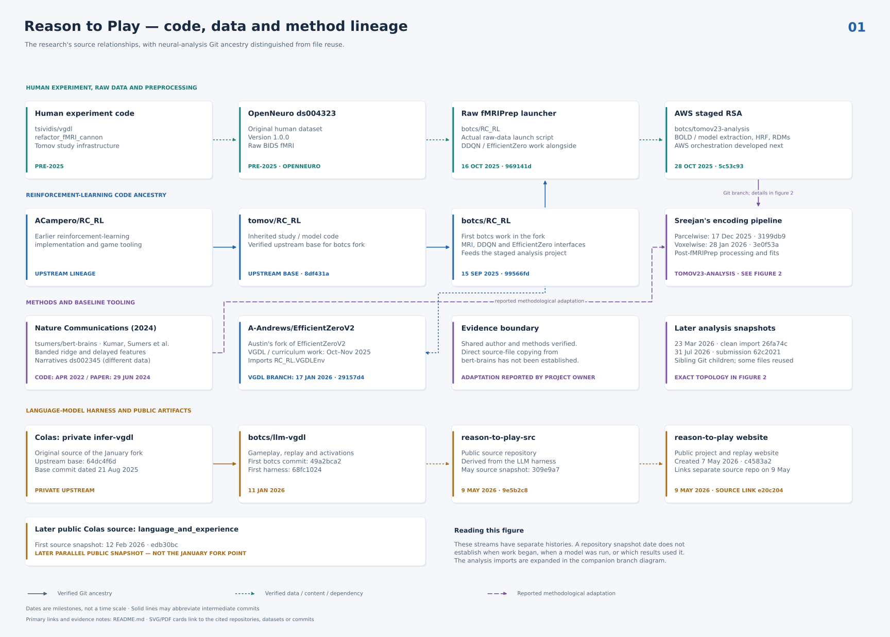
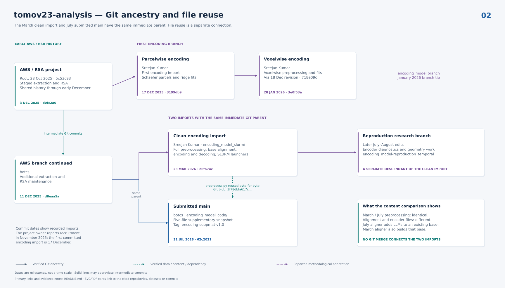

# Sources

Reason to Play brings together the original VGDL-fMRI experiment, reinforcement-learning
baselines, neural encoding analyses, and a Colas-based language-model harness.
This page documents those preceding research sources. For current commands and
inputs, use the [workflow guide](../reproducibility.md).





[Download the two-page PDF](lineage-all.pdf)

## Sources and implementations

| Research component | Origin | Current implementation or reference |
| --- | --- | --- |
| Original human experiment and EMPA | [tsividis/vgdl, refactor_fMRI_cannon](https://github.com/tsividis/vgdl/tree/refactor_fMRI_cannon); [OpenNeuro ds004323 v1.0.0](https://doi.org/10.18112/openneuro.ds004323.v1.0.0) | [Original behavioural schema](tomov23-behavior-notes.md); [public JSON specification](../data-format.md) |
| DDQN and baseline VGDL environments | [tomov/RC_RL](https://github.com/tomov/RC_RL), followed by [botcs/RC_RL](https://github.com/botcs/RC_RL) | [Baseline guide](../guides/baselines.md); [source pins](../../agents/ddqn/sources.json) |
| EfficientZero integration | Austin Andrews's [EfficientZeroV2 fork](https://github.com/A-Andrews/EfficientZeroV2/tree/29157d4892afd9467b1bd0994de1355086145490), based on [EfficientZeroV2](https://github.com/Shengjiewang-Jason/EfficientZeroV2) and using RC_RL environments | `agents/efficientzero/` contains extraction, inference and environment code, plus the optional pinned `training/` submodule; [source pins](../../agents/efficientzero/sources.json) and [training guide](../guides/baselines.md#efficientzero-training) |
| Raw fMRI preprocessing | [RC_RL launcher, October 2025](https://github.com/botcs/RC_RL/blob/969141d09369ecd783965fadbbe2a1920065cf24/fmriprep_pipeline/run_fmriprep.sh) | [Launcher/configuration records](../../reconstruction/tomov23/configs); [preprocessing guide](../guides/fmri-preprocessing.md) |
| Neural analysis | [botcs/tomov23-analysis](https://github.com/botcs/tomov23-analysis), with reported methodological influence from [bert-brains](https://github.com/tsumers/bert-brains) | [Per-file source map](code-origins.json); [analysis methods](../analysis-methods.md) |
| Language-model harness and game interpreter | January 2026 fork of Colas's private `ccolas/infer-vgdl`; related public [language_and_experience](https://github.com/ccolas/language_and_experience) | `agents/lrm/`, `environments/vgdl/`, `environments/definitions/`, `agents/lrm/prompts/` |
| DeepSeek extraction runtimes | Upstream V3.2 and V4 code with local loading/feature-hook adaptations | [V3.2 source record](../../agents/lrm/backends/deepseek_v32/PROVENANCE.json), [V4 source record](../../agents/lrm/backends/deepseek_v4/PROVENANCE.json); [runtime and license notices](../../THIRD_PARTY.md); [extraction guide](../reproducibility.md#optional-deepseek-runtimes) |

Source ancestry, methodological influence and producing-run attribution are
different claims. A matching repository or model name does not establish the
checkpoint and configuration that generated a result. The
[reproduction limits](../reproduction-limits.md) page identifies
remaining source-to-result gaps.

## Research timeline

Dates are commit dates unless another evidence type is stated. They establish
when work entered the retained history, not necessarily when it began.

| Date | Research development | Evidence |
| --- | --- | --- |
| 29 June 2024 | Kumar, Sumers and colleagues publish *Shared functional specialization in transformer-based language models and the human brain*, using Narratives fMRI. | [Nature Communications paper](https://www.nature.com/articles/s41467-024-49173-5), [official source archive](https://doi.org/10.5281/zenodo.10863840) |
| 15 September 2025 | Csaba's RC_RL work begins with environment, Python 3 and participant-replay changes. | [First current-team commit 99566fd](https://github.com/botcs/RC_RL/commit/99566fd07cb5d31da16802b2b2422109af289441) |
| September–October 2025 | DDQN input representation, training protocol and tracing work; identification of the original human/EMPA source. | [One-hot inputs](https://github.com/botcs/RC_RL/commit/0bb49b3c940aaabd91a5d362a8067e67db11b3d5), [source-reference correction](https://github.com/botcs/RC_RL/commit/15586a43fe054cdca89edab46fd8efef91228a9c) |
| 6 October 2025 | Austin's EfficientZero fork adds VGDL integration. | [09e62d2](https://github.com/A-Andrews/EfficientZeroV2/commit/09e62d2cd059eb1e78f3e50deac0ae8984aa764c) |
| 13–28 October 2025 | Retained fMRIPrep configurations record invocations across all 32 participants; the RC_RL launcher is committed on 16 October. | [Invocation index](fmriprep-invocations.csv), [launcher 969141d](https://github.com/botcs/RC_RL/commit/969141d09369ecd783965fadbbe2a1920065cf24) |
| 28 October–December 2025 | `tomov23-analysis` begins with existing fMRIPrep derivatives and develops an AWS-integrated staged RSA pipeline: features, HRF convolution, RDMs, similarity and QC. | [Root commit 5c53c93](https://github.com/botcs/tomov23-analysis/commit/5c53c931fce464c5f708e3f416db4330be434fa8), [DDQN dependency](https://github.com/botcs/tomov23-analysis/commit/6f69f9c) |
| Around November 2025 | Sreejan joins to develop neural alignment and encoding. | Author's account; Git does not establish recruitment dates. |
| 17–18 December 2025 | First committed Sreejan-authored parcelwise encoding pipeline, alignment and post-fMRIPrep preprocessing. | [3199db9](https://github.com/botcs/tomov23-analysis/commit/3199db9946ada6328fab419d2c5f9fb1bb9c5ca3), [718e09c](https://github.com/botcs/tomov23-analysis/commit/718e09c) |
| 11 January 2026 | Csaba starts the LLM game-agent harness from Colas's private source. | [Fork boundary 49a2bca](https://github.com/botcs/llm-vgdl/commit/49a2bca26ccd03aca5d3d67be9b6d2f3fb71b11c), [initial harness](https://github.com/botcs/llm-vgdl/commit/68fc1024013508633d0eeb00780ae6d5a3cbe74a) |
| January 2026 | Replay, hidden-state extraction and DeepSeek V3.2 support develop alongside baseline curriculum work. Voxelwise neural analysis is committed on 28 January. | [Feature extraction](https://github.com/botcs/llm-vgdl/commit/63df9438), [voxelwise pipeline 3e0f53a](https://github.com/botcs/tomov23-analysis/commit/3e0f53a750c6544fa9a6261adeb04c6441f08803) |
| 12 February 2026 | Colas's related public `language_and_experience` snapshot is committed. It is distinct from the source used in January. | [edb30bc](https://github.com/ccolas/language_and_experience/commit/edb30bc9815efad268605d337d63601d4f6f39a8) |
| March–April 2026 | Separate SLURM encoding import; LLM replay separates imputation/extraction and adopts explicit rationale modes and sliding windows. | [Encoding import 26fa74c](https://github.com/botcs/tomov23-analysis/commit/26fa74ce715781bfdd7a6f6a4bc2a6685e5a8678), [phase separation](https://github.com/botcs/llm-vgdl/commit/6a2d0aaf), [sliding windows](https://github.com/botcs/llm-vgdl/commit/13610e70) |
| May 2026 | Project website and separate public research-code repository appear. | [Website source](https://github.com/botcs/reason-to-play/commit/115dce3), [research-code export](https://github.com/botcs/reason-to-play-src/commit/9e5b2c8) |
| 31 July 2026 | The supplementary neural-code snapshot is committed separately from the continuing research branch. | [62c2021](https://github.com/botcs/tomov23-analysis/commit/62c202130d057e585b6bf7978f621fcd0255919c) |

## Reinforcement-learning baselines

The first current-team RC_RL commit has parent
`8df431a1b5311ad8ff9d1a55e0a3a04076128ab3`, the inspected Tomov upstream base.
Later 2021–2022 upstream DDQN/fMRI work also survives on the separate `fmri`
branch; it is not a linear ancestor of that `master` history. The original
human-experiment reference in RC_RL points to `tsividis/vgdl`, while RC_RL itself
contains the later team's baseline and environment work.

EfficientZero lives in Austin Andrews's separate fork. Its
[`ez/envs/vgdl` adapter](https://github.com/A-Andrews/EfficientZeroV2/blob/29157d4892afd9467b1bd0994de1355086145490/ez/envs/vgdl/__init__.py)
imports RC_RL's environment: this is a dependency relationship, not shared Git
ancestry. The substantive integration proceeds through `development` and
`integrated-development`, including
[October integration](https://github.com/A-Andrews/EfficientZeroV2/commit/bf13e302dd3f72c6bbaa7b15ae9354eccc89c482)
and [November curriculum support](https://github.com/A-Andrews/EfficientZeroV2/commit/8597088064cb5b9e0f3d6f366d87d850e306bd92).

The January configuration uses RGB observations and four warmup level IDs
(9–12). Those defaults alone do not identify the final paper's experiment.
Checkpoint and result-layer mappings are covered in
[reproduction limits](../reproduction-limits.md#baseline-checkpoints-and-layer-mappings).

## Neural-analysis sources

The December parcelwise import and January voxelwise pipeline descend from the
AWS/RSA history. The March `encoding_model_slurm` import and July supplementary
snapshot are sibling children of `d8eaa5a6c7fc3382967cb9e004748c89c99eb526`.
Their preprocessing file has the same Git blob,
`3f78dbfa617cca456b0e9301a879e93820a7ea77`, while their aligners and encoders differ.
Git-parent arrows therefore differ from arrows indicating reused file content.

Sreejan's preceding Nature paper used Narratives **ds002345**, with official
code at `tsumers/bert-brains`. Shared authorship and concrete methods—banded
ridge regression, delayed features, correlation scoring and nuisance inputs—
support methodological continuity. The project author's account identifies
adaptation from that work. A direct source-file-copy relationship has not been
established; the diagrams mark it as reported adaptation.

The official paper's source archive is
[Zenodo 10863840](https://doi.org/10.5281/zenodo.10863840), corresponding to
[the camera-ready source](https://github.com/tsumers/bert-brains/tree/26d4da6c1419fc8e635351ddb692897e2d0a1cc5).
Its source repository retains GPL-3.0, while the archive metadata states
CC-BY-4.0; retain source-file notices when examining reuse. Current VGDL
analysis choices are documented in [analysis methods](../analysis-methods.md).

## fMRI preprocessing sources

The original raw-data launcher belongs to RC_RL. It specifies fMRIPrep 24.1.0,
MNI152NLin2009cAsym 2 mm output, registration DOF 9, forced BBR, zero dummy
scans, seed 23 and no FreeSurfer surface reconstruction. Its shell and README
are retained with [source checksums](../../reconstruction/tomov23/configs/original-launcher/source.json).

The 38 retained configurations cover all 32 participants. One early sub-02
invocation used DOF 6; later records use DOF 9. The launcher uses Docker while
the configuration environment records say Singularity. These establish settings
and recorded invocations, without identifying the exact producing image digest
for every derivative.

Early `tomov23-analysis` stages uploaded existing derivatives and applied
T1w-to-MNI transforms using `antsApplyTransforms`. They were downstream of
raw preprocessing. The current [preprocessing guide](../guides/fmri-preprocessing.md)
uses the directly generated MNI derivatives and describes the analysis settings.

## Game translation

Current game descriptions use the Colas interpreter's dialect, shared with the
browser interpreter. Each replay contains one translated `game_description`.
Recorded trajectories establish what participants saw; replay rendering does
not simulate the original experiment again.

[`convert_tomov23_games.py`](convert_tomov23_games.py) preserves the historical
Tomov-to-Colas translation script. Its last recorded edit is
[6dfe6576, 22 March 2026](https://github.com/botcs/llm-vgdl/commit/6dfe65760f3934eb1eae6a5765e14a67ad1297c7).
Source snapshot SHA-256: `2a09720843c5b665c43b92671cd19e54421a17955c46623582ae3d9228fc9696`.
The included entrypoint takes explicit input/output directories and validates
with the current packaged interpreter; its translation rules follow that source.

The script history includes January conversion/indentation/interaction fixes,
a February Zelda indentation correction, and the March scoring-effect change.
It translates sprite hierarchies, colours, level mappings, scoring effects,
boundary interactions and termination parameters. Manual game-specific changes
also followed, including plaqueAttack scoring; the script alone does not fully
specify every maintained game definition. The [`environments/definitions/`](../../environments/definitions) files
and their history are authoritative for current experiments.

To inspect the conversion, supply explicit input and output directories:

```sh
mkdir -p /tmp/translated-vgdl-inspection
python docs/sources/convert_tomov23_games.py \
  --source /path/to/RC_RL/all_games \
  --target /tmp/translated-vgdl-inspection \
  --dry-run
```

`--dry-run` lists discovered files; it does not validate grammar transformations.
Removing it writes to the supplied target. For additional source measurement
fields, consult the [original behavioural reference](tomov23-behavior-notes.md),
whose preamble identifies known documentation errors. Ordinary dataset use
follows the [public JSON specification](../data-format.md).

## Evidence and figures

Solid arrows show Git ancestry and may omit intervening commits. Dotted arrows
show content or dependency relationships. The dashed Nature-to-VGDL arrow shows
reported methodological adaptation. Dates are milestones, not a metric time
axis; recruitment comes from the author's account. Private repository links
require access. The included references and figures remain readable locally.

[`generate_lineage.py`](generate_lineage.py) generates both figures with Python
and Matplotlib. It writes SVG, PNG and individual PDFs, plus `lineage-all.pdf`,
beside the script. Vector text remains selectable and source links are clickable.
